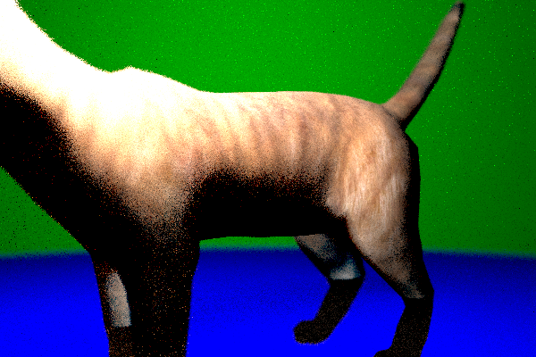

# raytracer 306
a simple C++ raytracer  

author: Matthias Hasler  
CSE306 - Ecole polytechnique, Bachelor of Science - SS20  

## files
- `vec.cpp` vector and ray classes
- `random.cpp` random sampling of rays
- `mat.cpp` material and UV classes
- `sphere.cpp` self explanatory
- `mesh.cpp` triangle, mesh and BVH tree
- `main.cpp` scene, camera, and tiny `.obj` parser; rendering

(for grading)
`pandoc <(echo "# Report"; cat README.md) -o report.pdf`

## features
this raytracer can render:

- diffuse, refractive, reflective and emitting spheres
- meshes, with UV mapping

it does not handle phong reflections nor dissipative media (smoke, etc.)

## details and tricks
### parallelism
OpenMP, dynamic scheduling over the lines rendered

### monte carlo
- effects like soft shadows are achieved by shooting
several rays per pixel and sampling bouncing rays from random distributions
- depth of field is achieved by shooting rays from various positions
in the aperture aiming at the focal plane
- for antialiasing, we introduce normal noise when aiming at the focal plane

### refraction
We check whether the ray coming in or out.
Since we only care about n1/n2
[(Snell's law)](https://en.wikipedia.org/wiki/Snell%27s_law),
we can simply invert the refractive index depending on the case.
To emulate refractive indices of nested objects,
one should divide the real refractive index
by the ambient one.

### parser
expects `f v/vt/vn` and `vn x y z`

## external res
- `Models_F0202A090/*` cat model and texture
- `stb_image_write.h` and `stb_image.h`

## renders
recursion depth limit set to 5, resolution 600 x 400

