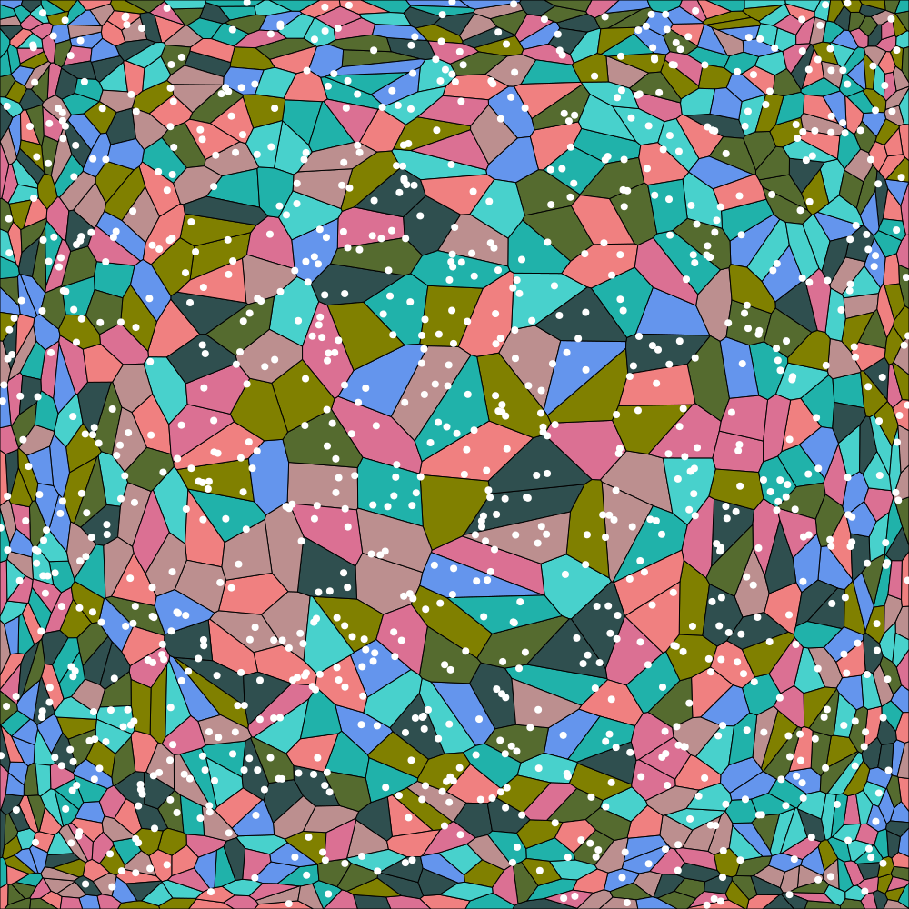

# Voronoi Diagram, Power Cells and Fluid Simulation

author: Matthias Hasler  
CSE306 - Ecole polytechnique, Bachelor of Science - SS20  

## files and folders
- `main.cpp` simple driver
- `main.h` the actual code
- `incl/` libraries to be include (lbfgs, nanoflann, stb)
- `pics/` outputs
- `report.pdf = (pdf)*this`

## sections
`main.h` is splitted into several sections:
- `convex power cell`: cells are polygons centered in their seed, and constructed by repeatedly adding points
- `random stuff`: several functions to sample points,
  and Lloyd's algorithm is implemented in `social_distancing`
- `dell optiplex`: lbfgs callbacks to compute weights for given parameters
- `petri dish tasting`: power cell diagram with food in the center
- `enter the simulation`: fluid simulation
- `messy details`: cell's `add_pt area inertia centroid` and `get_diagram` with neighbour search (nanoflann) optimization
- `taking pics`: render to svg and png

## other features
- parallelism: because why not
- stills to animation: `make animate`

## external resources
- `incl/stb_image_write.h` writing to png
[STB library](https://github.com/nothings/stb)
- `incl/nanoflann.hpp` KDTree 
[nanoflann library](https://github.com/jlblancoc/nanoflann)
- `incl/libfgs.*` `incl/arithmetic_ansi.h` optimizer

## renders

